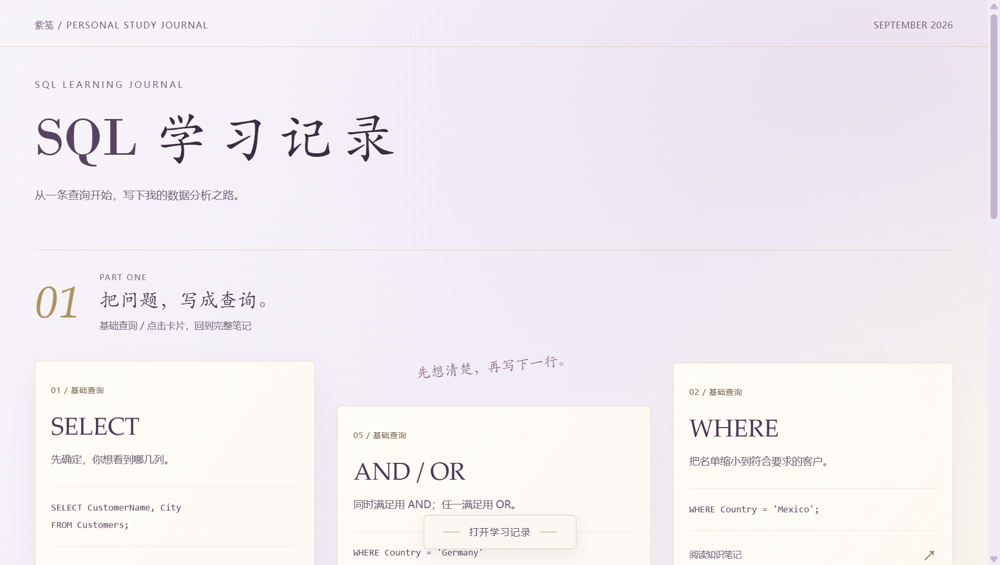
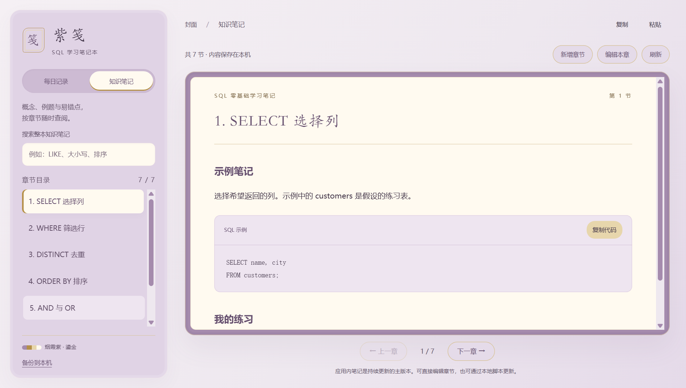

# 紫笺 SQL 学习笔记本

把分散的 SQL 笔记、每日学习记录和个人手记放进一个本地桌面应用。支持章节检索、直接编辑、SQL 代码复制、自动保存与历史备份。

A local-first Windows notebook for SQL learning, with searchable chapters, daily journals, backups, and a file-based AI agent workflow.




## 下载使用

在 [Releases](https://github.com/lambily555/zijian-sql-notebook/releases) 下载 Windows x64 ZIP，完整解压到可写目录，双击 `打开紫笺.cmd`，或运行 `desktop/zijian.exe`。无需安装 Node.js，无需账号。

程序、数据与备份保存在解压目录中，请不要只移动 EXE。更新版本时先在应用内备份，解压新版本到另一个目录，再迁移自己的 `data/`；不要用示例数据覆盖旧笔记。

## 能做什么

- 按章节阅读、搜索全文、新增与编辑知识笔记，复制 SQL 示例。
- 按日期写手记，停笔后自动保存，也支持 Ctrl+S。
- 保存前备份历史数据；自动合并正在书写与外部批改等不同位置的更新。同一处文字发生冲突时，自动备份草稿并保留页面，不静默覆盖。
- 撤回／重做支持粘贴文字和图片；无变化的定期刷新不会重置编辑历史。复制 SQL 时过滤零宽空格，保留正常空格和换行。
- 关闭窗口时先保存再隐藏到托盘；从托盘彻底退出或保存后重启。
- 通过本地更新脚本配合 Codex 等 AI Agent 整理笔记，更新后在应用中刷新查看。

它是笔记工具，不执行 SQL，也不内置大模型调用或聊天服务。AI 整理工作发生在你自行使用的 Agent 中。

## 从实际需求到工具

这个个人项目由 SQL 学习中的笔记查阅、重复整理和持续更新需求出发，使用 Codex 辅助开发。开发过程中由作者提出需求、体验功能、反馈问题，持续迭代到独立桌面应用。

主要工作包括把原有文档转为章节化内容，组织每日记录与自由手记，加入保存与备份流程，以及处理应用编辑和外部脚本同时更新时的版本冲突。

公开版保留紫笺的烟紫、淡金配色和纸页式阅读体验，使用 SQL 主题封面与 7 节匿名示例笔记。仓库和下载包不包含作者的真实手记、学习记录、私人照片或本机配置。

## 开发运行

Windows，Node.js 22 或更高版本：

```bash
npm install
npm start
```

```bash
npm test
npm run build:win
```

打包输出位于 `release/zijian-sql-notebook-win32-x64/`。为避免把使用过程中写入的笔记打包出去，构建脚本从 Git 的 HEAD 读取已提交的匿名种子数据；请在构建前提交代码，并保持仓库中的种子数据匿名。输出目录已存在时构建会停止，请先将旧输出移开。

## 与 AI Agent 配合更新

1. 让 Agent 阅读 `data/knowledge.json`，定位需要更新的章节。
2. 将新增概念与原内容合并，保留原章节 ID 和当前 `revision`。
3. 生成单章 JSON，通过下方脚本保存，再在 App 中点击刷新。

```bash
node knowledge_update.cjs chapter-update.json
```

单章更新格式：

```json
{
  "id": "chapter-05",
  "title": "1. SELECT 选择列",
  "content": "完整的合并后正文",
  "revision": 1
}
```

`revision` 必须使用实际读取到的当前值。脚本与应用共用文件锁、版本核验、备份和临时文件替换机制。发生冲突时重新读取并合并，不强制覆盖。新增章节使用新的 ID，`revision` 为 0。

`data/coach.json` 保存外部整理的每日学习摘要，`data/journal.json` 保存个人手记，`data/knowledge.json` 保存知识笔记；`backups/` 保存历史版本。请勿将自己的真实数据再次提交到公开仓库。

## 实现

Electron、原生 HTML/CSS/JavaScript、本地 JSON 文件。渲染进程隔离于 Node.js，通过限定的本地协议读写笔记；无需后台 Web 服务。窗口与托盘、剪贴板和文件操作由 Electron 主进程负责。

## 许可

项目代码、公开版图标与示例笔记使用 MIT License。下载包包含的 Electron、Chromium 及其他第三方组件遵循各自随附的许可证。
